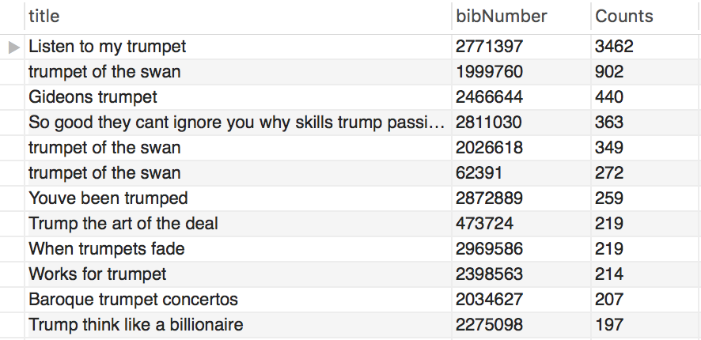
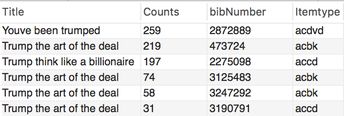
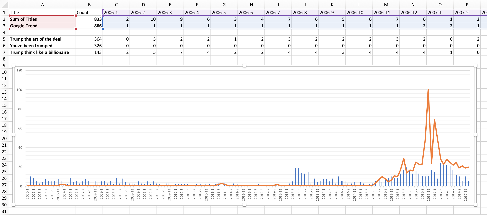

# How Politics Influence People's Reading Consumption
### Home Work 1, MAT 259
Chengyuan Xu, Jan 22, 2018
Based on data from Seattle Public Library
Keywords: Politics, Donald Trump, Book, CD, DVD

<!---
## find out the relationship between the popularity of digital camera and reference books

## think about other relations, a stronger tie between photography and book

* books of photography in general
* Pulitzer prize
* major news events' impact on readers
* domestic disasters
* 9/11
* books of specific models
  * iPhone photography
  * Flickr camera popularity
* book for dummies (photography, camera, video camera)
* book of popular camera models
* find out best selling cameras (commercial vs. professional)
* book for [dummies](http://www.dummies.com/photography/)
  * Cameras
  * Digital Photography
  * Photo Software
  * Video
* North Korea !!!!!

| year | digital / film | camera | number of checkous |
| ---- | -------------- | ------ | ------------------ |
|      |                |        |                    |
|      |                |        |                    |
-->

I'm curious to see how politics influence people on their reading materials. If we search the name of the current president Donald Trump on Amazon books, we can find as many as six pages of results. He co-authored most of these books. I believe that if people are curious about their presidential candidate, frequent library visitors might be interested in book by him or about him.

Trump's campaign started in June 2015 and since then he has been a frequent visitor of media headlines. I assume that a correlation between major milestones during his campaign and the checked-in/out records of his books in the Seattle Public Library.

### Data Analysis Queries

~~~~sql
SELECT 
    title, bibNumber, COUNT(bibNumber) AS Counts
FROM
    spl_2016.inraw
WHERE
    title LIKE '%Trump%'
GROUP BY title , bibNumber
ORDER BY Counts DESC
LIMIT 1000
~~~~

I started with the above code to check what are the most borrowed materials that are related to the word Trump. Many of the results came back irrelevant but still I found some of his best selling book / audio-book like *Trump: The Art of the Deal*, *Trump: Think Like a Billionaire*, and a documentary named *You've Been Trumped* from 2012. 

> Each **bibNumber** represents an edition / type of media of each title. 

One issue of the results from this query is that the total number of samples is not very big. But putting the results from these three different materials (one book, one CD and one DVD) should be enough to represent a trend in general. 

Next I modified the query to show how many times each of the titles been checked-in.

> From ItemType we can find the title *Trump: The Art of the Deal* have three different editions of book and one version of CD in Seattle Public Library. *Trump: Think Like a Billionaire* is also CD and *You've Been Trumped* is DVD.

~~~~sql
SELECT 
    Title, COUNT(bibNumber) AS Counts, bibNumber, Itemtype
FROM
    spl_2016.inraw
WHERE
    title = 'Trump The Art of the Deal'
        OR title = 'Trump Think Like a Billionaire'
        OR title = 'Youve Been Trumped'
GROUP BY title , bibNumber , itemtype
ORDER BY Counts DESC
LIMIT 1000
~~~~

Since we only care consider the correlation between Trump's campaign and related titles, there is no need to count the same title *Trump: The Art of the Deal* in with four different bibNumbers. Even though they are different media, three books and one CD.

The modified query combines different bibNumbers of the same title into one entry. Referenced the monthly analysis code from Rodger Luo's Blade Runner report, the data exported as a .cvs file from MySQL for further processing.

When we laid the internet search trending date of from Google Trend over the titles' data we extracted from Seattle Public Library, we can find a matching trend from two different sources.

> **Blue Bars** are checking records from the library for each month from January 2006 to December 2017. **Orage Line** is the searching trend from Google, of the same period of time.

### Assumptions & Analysis

1. **March 2013** - We noticed an quick rise in the library's data yet it is not reflected in Google's search data. That is because the library purchased the DVD of documentary *You've Been Trumped* in February 2013. Meanwhile the other two older titles showed very few checking records, which match the trend on internet.

2. **July 2015** - Trump officially announced his candidacy for president of the United States. We saw an obvious rise of attention on the internet, based on Google and that trend can be noticed on library's checking records as well.

3. **March 2016** -  Trump won seven of the 11 states that vote on so-called Super Tuesday. Meanwhile he continues to draw huge crowds to sometimes volatile rallies, where protesters and Trump supporters would sometimes come to blows.

4. **September & October 2016** - Two presidential debates took place and the national attention reached all time peak. On the contrary, the library's checking records showed a decline. I believe an plausible explanation for this opposite trend is because readers who borrowed the book/DVD decided to hold on to the titles a little longer. They could either read the book seriously or share the DVD with friends, rather than returning the most popular title of the time back to the library, thus the decline in records.

### Query of the monthly records

~~~~sql
SELECT 
    Title,
    COUNT(title) AS Counts,
    SUM(CASE
        WHEN (YEAR(cout) = 2006 AND MONTH(cout) = 1) THEN 1
        ELSE 0
    END) AS '2006-1',
    SUM(CASE
        WHEN (YEAR(cout) = 2006 AND MONTH(cout) = 2) THEN 1
        ELSE 0
    END) AS '2006-2',
    SUM(CASE
        WHEN (YEAR(cout) = 2006 AND MONTH(cout) = 3) THEN 1
        ELSE 0
    END) AS '2006-3',
    SUM(CASE
        WHEN (YEAR(cout) = 2006 AND MONTH(cout) = 4) THEN 1
        ELSE 0
    END) AS '2006-4',
    SUM(CASE
        WHEN (YEAR(cout) = 2006 AND MONTH(cout) = 5) THEN 1
        ELSE 0
    END) AS '2006-5',
    SUM(CASE
        WHEN (YEAR(cout) = 2006 AND MONTH(cout) = 6) THEN 1
        ELSE 0
    END) AS '2006-6',
    SUM(CASE
        WHEN (YEAR(cout) = 2006 AND MONTH(cout) = 7) THEN 1
        ELSE 0
    END) AS '2006-7',
    SUM(CASE
        WHEN (YEAR(cout) = 2006 AND MONTH(cout) = 8) THEN 1
        ELSE 0
    END) AS '2006-8',
    SUM(CASE
        WHEN (YEAR(cout) = 2006 AND MONTH(cout) = 9) THEN 1
        ELSE 0
    END) AS '2006-9',
    SUM(CASE
        WHEN (YEAR(cout) = 2006 AND MONTH(cout) = 10) THEN 1
        ELSE 0
    END) AS '2006-10',
    SUM(CASE
        WHEN (YEAR(cout) = 2006 AND MONTH(cout) = 11) THEN 1
        ELSE 0
    END) AS '2006-11',
    SUM(CASE
        WHEN (YEAR(cout) = 2006 AND MONTH(cout) = 12) THEN 1
        ELSE 0
    END) AS '2006-12',
    SUM(CASE
        WHEN (YEAR(cout) = 2007 AND MONTH(cout) = 1) THEN 1
        ELSE 0
    END) AS '2007-1',
    SUM(CASE
        WHEN (YEAR(cout) = 2007 AND MONTH(cout) = 2) THEN 1
        ELSE 0
    END) AS '2007-2',
    SUM(CASE
        WHEN (YEAR(cout) = 2007 AND MONTH(cout) = 3) THEN 1
        ELSE 0
    END) AS '2007-3',
    SUM(CASE
        WHEN (YEAR(cout) = 2007 AND MONTH(cout) = 4) THEN 1
        ELSE 0
    END) AS '2007-4',
    SUM(CASE
        WHEN (YEAR(cout) = 2007 AND MONTH(cout) = 5) THEN 1
        ELSE 0
    END) AS '2007-5',
    SUM(CASE
        WHEN (YEAR(cout) = 2007 AND MONTH(cout) = 6) THEN 1
        ELSE 0
    END) AS '2007-6',
    SUM(CASE
        WHEN (YEAR(cout) = 2007 AND MONTH(cout) = 7) THEN 1
        ELSE 0
    END) AS '2007-7',
    SUM(CASE
        WHEN (YEAR(cout) = 2007 AND MONTH(cout) = 8) THEN 1
        ELSE 0
    END) AS '2007-8',
    SUM(CASE
        WHEN (YEAR(cout) = 2007 AND MONTH(cout) = 9) THEN 1
        ELSE 0
    END) AS '2007-9',
    SUM(CASE
        WHEN (YEAR(cout) = 2007 AND MONTH(cout) = 10) THEN 1
        ELSE 0
    END) AS '2007-10',
    SUM(CASE
        WHEN (YEAR(cout) = 2007 AND MONTH(cout) = 11) THEN 1
        ELSE 0
    END) AS '2007-11',
    SUM(CASE
        WHEN (YEAR(cout) = 2007 AND MONTH(cout) = 12) THEN 1
        ELSE 0
    END) AS '2007-12',
    SUM(CASE
        WHEN (YEAR(cout) = 2008 AND MONTH(cout) = 1) THEN 1
        ELSE 0
    END) AS '2008-1',
    SUM(CASE
        WHEN (YEAR(cout) = 2008 AND MONTH(cout) = 2) THEN 1
        ELSE 0
    END) AS '2008-2',
    SUM(CASE
        WHEN (YEAR(cout) = 2008 AND MONTH(cout) = 3) THEN 1
        ELSE 0
    END) AS '2008-3',
    SUM(CASE
        WHEN (YEAR(cout) = 2008 AND MONTH(cout) = 4) THEN 1
        ELSE 0
    END) AS '2008-4',
    SUM(CASE
        WHEN (YEAR(cout) = 2008 AND MONTH(cout) = 5) THEN 1
        ELSE 0
    END) AS '2008-5',
    SUM(CASE
        WHEN (YEAR(cout) = 2008 AND MONTH(cout) = 6) THEN 1
        ELSE 0
    END) AS '2008-6',
    SUM(CASE
        WHEN (YEAR(cout) = 2008 AND MONTH(cout) = 7) THEN 1
        ELSE 0
    END) AS '2008-7',
    SUM(CASE
        WHEN (YEAR(cout) = 2008 AND MONTH(cout) = 8) THEN 1
        ELSE 0
    END) AS '2008-8',
    SUM(CASE
        WHEN (YEAR(cout) = 2008 AND MONTH(cout) = 9) THEN 1
        ELSE 0
    END) AS '2008-9',
    SUM(CASE
        WHEN (YEAR(cout) = 2008 AND MONTH(cout) = 10) THEN 1
        ELSE 0
    END) AS '2008-10',
    SUM(CASE
        WHEN (YEAR(cout) = 2008 AND MONTH(cout) = 11) THEN 1
        ELSE 0
    END) AS '2008-11',
    SUM(CASE
        WHEN (YEAR(cout) = 2008 AND MONTH(cout) = 12) THEN 1
        ELSE 0
    END) AS '2008-12',
    SUM(CASE
        WHEN (YEAR(cout) = 2009 AND MONTH(cout) = 1) THEN 1
        ELSE 0
    END) AS '2009-1',
    SUM(CASE
        WHEN (YEAR(cout) = 2009 AND MONTH(cout) = 2) THEN 1
        ELSE 0
    END) AS '2009-2',
    SUM(CASE
        WHEN (YEAR(cout) = 2009 AND MONTH(cout) = 3) THEN 1
        ELSE 0
    END) AS '2009-3',
    SUM(CASE
        WHEN (YEAR(cout) = 2009 AND MONTH(cout) = 4) THEN 1
        ELSE 0
    END) AS '2009-4',
    SUM(CASE
        WHEN (YEAR(cout) = 2009 AND MONTH(cout) = 5) THEN 1
        ELSE 0
    END) AS '2009-5',
    SUM(CASE
        WHEN (YEAR(cout) = 2009 AND MONTH(cout) = 6) THEN 1
        ELSE 0
    END) AS '2009-6',
    SUM(CASE
        WHEN (YEAR(cout) = 2009 AND MONTH(cout) = 7) THEN 1
        ELSE 0
    END) AS '2009-7',
    SUM(CASE
        WHEN (YEAR(cout) = 2009 AND MONTH(cout) = 8) THEN 1
        ELSE 0
    END) AS '2009-8',
    SUM(CASE
        WHEN (YEAR(cout) = 2009 AND MONTH(cout) = 9) THEN 1
        ELSE 0
    END) AS '2009-9',
    SUM(CASE
        WHEN (YEAR(cout) = 2009 AND MONTH(cout) = 10) THEN 1
        ELSE 0
    END) AS '2009-10',
    SUM(CASE
        WHEN (YEAR(cout) = 2009 AND MONTH(cout) = 11) THEN 1
        ELSE 0
    END) AS '2009-11',
    SUM(CASE
        WHEN (YEAR(cout) = 2009 AND MONTH(cout) = 12) THEN 1
        ELSE 0
    END) AS '2009-12',
    SUM(CASE
        WHEN (YEAR(cout) = 2010 AND MONTH(cout) = 1) THEN 1
        ELSE 0
    END) AS '2010-1',
    SUM(CASE
        WHEN (YEAR(cout) = 2010 AND MONTH(cout) = 2) THEN 1
        ELSE 0
    END) AS '2010-2',
    SUM(CASE
        WHEN (YEAR(cout) = 2010 AND MONTH(cout) = 3) THEN 1
        ELSE 0
    END) AS '2010-3',
    SUM(CASE
        WHEN (YEAR(cout) = 2010 AND MONTH(cout) = 4) THEN 1
        ELSE 0
    END) AS '2010-4',
    SUM(CASE
        WHEN (YEAR(cout) = 2010 AND MONTH(cout) = 5) THEN 1
        ELSE 0
    END) AS '2010-5',
    SUM(CASE
        WHEN (YEAR(cout) = 2010 AND MONTH(cout) = 6) THEN 1
        ELSE 0
    END) AS '2010-6',
    SUM(CASE
        WHEN (YEAR(cout) = 2010 AND MONTH(cout) = 7) THEN 1
        ELSE 0
    END) AS '2010-7',
    SUM(CASE
        WHEN (YEAR(cout) = 2010 AND MONTH(cout) = 8) THEN 1
        ELSE 0
    END) AS '2010-8',
    SUM(CASE
        WHEN (YEAR(cout) = 2010 AND MONTH(cout) = 9) THEN 1
        ELSE 0
    END) AS '2010-9',
    SUM(CASE
        WHEN (YEAR(cout) = 2010 AND MONTH(cout) = 10) THEN 1
        ELSE 0
    END) AS '2010-10',
    SUM(CASE
        WHEN (YEAR(cout) = 2010 AND MONTH(cout) = 11) THEN 1
        ELSE 0
    END) AS '2010-11',
    SUM(CASE
        WHEN (YEAR(cout) = 2010 AND MONTH(cout) = 12) THEN 1
        ELSE 0
    END) AS '2010-12',
    SUM(CASE
        WHEN (YEAR(cout) = 2011 AND MONTH(cout) = 1) THEN 1
        ELSE 0
    END) AS '2011-1',
    SUM(CASE
        WHEN (YEAR(cout) = 2011 AND MONTH(cout) = 2) THEN 1
        ELSE 0
    END) AS '2011-2',
    SUM(CASE
        WHEN (YEAR(cout) = 2011 AND MONTH(cout) = 3) THEN 1
        ELSE 0
    END) AS '2011-3',
    SUM(CASE
        WHEN (YEAR(cout) = 2011 AND MONTH(cout) = 4) THEN 1
        ELSE 0
    END) AS '2011-4',
    SUM(CASE
        WHEN (YEAR(cout) = 2011 AND MONTH(cout) = 5) THEN 1
        ELSE 0
    END) AS '2011-5',
    SUM(CASE
        WHEN (YEAR(cout) = 2011 AND MONTH(cout) = 6) THEN 1
        ELSE 0
    END) AS '2011-6',
    SUM(CASE
        WHEN (YEAR(cout) = 2011 AND MONTH(cout) = 7) THEN 1
        ELSE 0
    END) AS '2011-7',
    SUM(CASE
        WHEN (YEAR(cout) = 2011 AND MONTH(cout) = 8) THEN 1
        ELSE 0
    END) AS '2011-8',
    SUM(CASE
        WHEN (YEAR(cout) = 2011 AND MONTH(cout) = 9) THEN 1
        ELSE 0
    END) AS '2011-9',
    SUM(CASE
        WHEN (YEAR(cout) = 2011 AND MONTH(cout) = 10) THEN 1
        ELSE 0
    END) AS '2011-10',
    SUM(CASE
        WHEN (YEAR(cout) = 2011 AND MONTH(cout) = 11) THEN 1
        ELSE 0
    END) AS '2011-11',
    SUM(CASE
        WHEN (YEAR(cout) = 2011 AND MONTH(cout) = 12) THEN 1
        ELSE 0
    END) AS '2011-12',
    SUM(CASE
        WHEN (YEAR(cout) = 2012 AND MONTH(cout) = 1) THEN 1
        ELSE 0
    END) AS '2012-1',
    SUM(CASE
        WHEN (YEAR(cout) = 2012 AND MONTH(cout) = 2) THEN 1
        ELSE 0
    END) AS '2012-2',
    SUM(CASE
        WHEN (YEAR(cout) = 2012 AND MONTH(cout) = 3) THEN 1
        ELSE 0
    END) AS '2012-3',
    SUM(CASE
        WHEN (YEAR(cout) = 2012 AND MONTH(cout) = 4) THEN 1
        ELSE 0
    END) AS '2012-4',
    SUM(CASE
        WHEN (YEAR(cout) = 2012 AND MONTH(cout) = 5) THEN 1
        ELSE 0
    END) AS '2012-5',
    SUM(CASE
        WHEN (YEAR(cout) = 2012 AND MONTH(cout) = 6) THEN 1
        ELSE 0
    END) AS '2012-6',
    SUM(CASE
        WHEN (YEAR(cout) = 2012 AND MONTH(cout) = 7) THEN 1
        ELSE 0
    END) AS '2012-7',
    SUM(CASE
        WHEN (YEAR(cout) = 2012 AND MONTH(cout) = 8) THEN 1
        ELSE 0
    END) AS '2012-8',
    SUM(CASE
        WHEN (YEAR(cout) = 2012 AND MONTH(cout) = 9) THEN 1
        ELSE 0
    END) AS '2012-9',
    SUM(CASE
        WHEN (YEAR(cout) = 2012 AND MONTH(cout) = 10) THEN 1
        ELSE 0
    END) AS '2012-10',
    SUM(CASE
        WHEN (YEAR(cout) = 2012 AND MONTH(cout) = 11) THEN 1
        ELSE 0
    END) AS '2012-11',
    SUM(CASE
        WHEN (YEAR(cout) = 2012 AND MONTH(cout) = 12) THEN 1
        ELSE 0
    END) AS '2012-12',
    SUM(CASE
        WHEN (YEAR(cout) = 2013 AND MONTH(cout) = 1) THEN 1
        ELSE 0
    END) AS '2013-1',
    SUM(CASE
        WHEN (YEAR(cout) = 2013 AND MONTH(cout) = 2) THEN 1
        ELSE 0
    END) AS '2013-2',
    SUM(CASE
        WHEN (YEAR(cout) = 2013 AND MONTH(cout) = 3) THEN 1
        ELSE 0
    END) AS '2013-3',
    SUM(CASE
        WHEN (YEAR(cout) = 2013 AND MONTH(cout) = 4) THEN 1
        ELSE 0
    END) AS '2013-4',
    SUM(CASE
        WHEN (YEAR(cout) = 2013 AND MONTH(cout) = 5) THEN 1
        ELSE 0
    END) AS '2013-5',
    SUM(CASE
        WHEN (YEAR(cout) = 2013 AND MONTH(cout) = 6) THEN 1
        ELSE 0
    END) AS '2013-6',
    SUM(CASE
        WHEN (YEAR(cout) = 2013 AND MONTH(cout) = 7) THEN 1
        ELSE 0
    END) AS '2013-7',
    SUM(CASE
        WHEN (YEAR(cout) = 2013 AND MONTH(cout) = 8) THEN 1
        ELSE 0
    END) AS '2013-8',
    SUM(CASE
        WHEN (YEAR(cout) = 2013 AND MONTH(cout) = 9) THEN 1
        ELSE 0
    END) AS '2013-9',
    SUM(CASE
        WHEN (YEAR(cout) = 2013 AND MONTH(cout) = 10) THEN 1
        ELSE 0
    END) AS '2013-10',
    SUM(CASE
        WHEN (YEAR(cout) = 2013 AND MONTH(cout) = 11) THEN 1
        ELSE 0
    END) AS '2013-11',
    SUM(CASE
        WHEN (YEAR(cout) = 2013 AND MONTH(cout) = 12) THEN 1
        ELSE 0
    END) AS '2013-12',
    SUM(CASE
        WHEN (YEAR(cout) = 2014 AND MONTH(cout) = 1) THEN 1
        ELSE 0
    END) AS '2014-1',
    SUM(CASE
        WHEN (YEAR(cout) = 2014 AND MONTH(cout) = 2) THEN 1
        ELSE 0
    END) AS '2014-2',
    SUM(CASE
        WHEN (YEAR(cout) = 2014 AND MONTH(cout) = 3) THEN 1
        ELSE 0
    END) AS '2014-3',
    SUM(CASE
        WHEN (YEAR(cout) = 2014 AND MONTH(cout) = 4) THEN 1
        ELSE 0
    END) AS '2014-4',
    SUM(CASE
        WHEN (YEAR(cout) = 2014 AND MONTH(cout) = 5) THEN 1
        ELSE 0
    END) AS '2014-5',
    SUM(CASE
        WHEN (YEAR(cout) = 2014 AND MONTH(cout) = 6) THEN 1
        ELSE 0
    END) AS '2014-6',
    SUM(CASE
        WHEN (YEAR(cout) = 2014 AND MONTH(cout) = 7) THEN 1
        ELSE 0
    END) AS '2014-7',
    SUM(CASE
        WHEN (YEAR(cout) = 2014 AND MONTH(cout) = 8) THEN 1
        ELSE 0
    END) AS '2014-8',
    SUM(CASE
        WHEN (YEAR(cout) = 2014 AND MONTH(cout) = 9) THEN 1
        ELSE 0
    END) AS '2014-9',
    SUM(CASE
        WHEN (YEAR(cout) = 2014 AND MONTH(cout) = 10) THEN 1
        ELSE 0
    END) AS '2014-10',
    SUM(CASE
        WHEN (YEAR(cout) = 2014 AND MONTH(cout) = 11) THEN 1
        ELSE 0
    END) AS '2014-11',
    SUM(CASE
        WHEN (YEAR(cout) = 2014 AND MONTH(cout) = 12) THEN 1
        ELSE 0
    END) AS '2014-12',
    SUM(CASE
        WHEN (YEAR(cout) = 2015 AND MONTH(cout) = 1) THEN 1
        ELSE 0
    END) AS '2015-1',
    SUM(CASE
        WHEN (YEAR(cout) = 2015 AND MONTH(cout) = 2) THEN 1
        ELSE 0
    END) AS '2015-2',
    SUM(CASE
        WHEN (YEAR(cout) = 2015 AND MONTH(cout) = 3) THEN 1
        ELSE 0
    END) AS '2015-3',
    SUM(CASE
        WHEN (YEAR(cout) = 2015 AND MONTH(cout) = 4) THEN 1
        ELSE 0
    END) AS '2015-4',
    SUM(CASE
        WHEN (YEAR(cout) = 2015 AND MONTH(cout) = 5) THEN 1
        ELSE 0
    END) AS '2015-5',
    SUM(CASE
        WHEN (YEAR(cout) = 2015 AND MONTH(cout) = 6) THEN 1
        ELSE 0
    END) AS '2015-6',
    SUM(CASE
        WHEN (YEAR(cout) = 2015 AND MONTH(cout) = 7) THEN 1
        ELSE 0
    END) AS '2015-7',
    SUM(CASE
        WHEN (YEAR(cout) = 2015 AND MONTH(cout) = 8) THEN 1
        ELSE 0
    END) AS '2015-8',
    SUM(CASE
        WHEN (YEAR(cout) = 2015 AND MONTH(cout) = 9) THEN 1
        ELSE 0
    END) AS '2015-9',
    SUM(CASE
        WHEN (YEAR(cout) = 2015 AND MONTH(cout) = 10) THEN 1
        ELSE 0
    END) AS '2015-10',
    SUM(CASE
        WHEN (YEAR(cout) = 2015 AND MONTH(cout) = 11) THEN 1
        ELSE 0
    END) AS '2015-11',
    SUM(CASE
        WHEN (YEAR(cout) = 2015 AND MONTH(cout) = 12) THEN 1
        ELSE 0
    END) AS '2015-12',
    SUM(CASE
        WHEN (YEAR(cout) = 2016 AND MONTH(cout) = 1) THEN 1
        ELSE 0
    END) AS '2016-1',
    SUM(CASE
        WHEN (YEAR(cout) = 2016 AND MONTH(cout) = 2) THEN 1
        ELSE 0
    END) AS '2016-2',
    SUM(CASE
        WHEN (YEAR(cout) = 2016 AND MONTH(cout) = 3) THEN 1
        ELSE 0
    END) AS '2016-3',
    SUM(CASE
        WHEN (YEAR(cout) = 2016 AND MONTH(cout) = 4) THEN 1
        ELSE 0
    END) AS '2016-4',
    SUM(CASE
        WHEN (YEAR(cout) = 2016 AND MONTH(cout) = 5) THEN 1
        ELSE 0
    END) AS '2016-5',
    SUM(CASE
        WHEN (YEAR(cout) = 2016 AND MONTH(cout) = 6) THEN 1
        ELSE 0
    END) AS '2016-6',
    SUM(CASE
        WHEN (YEAR(cout) = 2016 AND MONTH(cout) = 7) THEN 1
        ELSE 0
    END) AS '2016-7',
    SUM(CASE
        WHEN (YEAR(cout) = 2016 AND MONTH(cout) = 8) THEN 1
        ELSE 0
    END) AS '2016-8',
    SUM(CASE
        WHEN (YEAR(cout) = 2016 AND MONTH(cout) = 9) THEN 1
        ELSE 0
    END) AS '2016-9',
    SUM(CASE
        WHEN (YEAR(cout) = 2016 AND MONTH(cout) = 10) THEN 1
        ELSE 0
    END) AS '2016-10',
    SUM(CASE
        WHEN (YEAR(cout) = 2016 AND MONTH(cout) = 11) THEN 1
        ELSE 0
    END) AS '2016-11',
    SUM(CASE
        WHEN (YEAR(cout) = 2016 AND MONTH(cout) = 12) THEN 1
        ELSE 0
    END) AS '2016-12',
    SUM(CASE
        WHEN (YEAR(cout) = 2017 AND MONTH(cout) = 1) THEN 1
        ELSE 0
    END) AS '2017-1',
    SUM(CASE
        WHEN (YEAR(cout) = 2017 AND MONTH(cout) = 2) THEN 1
        ELSE 0
    END) AS '2017-2',
    SUM(CASE
        WHEN (YEAR(cout) = 2017 AND MONTH(cout) = 3) THEN 1
        ELSE 0
    END) AS '2017-3',
    SUM(CASE
        WHEN (YEAR(cout) = 2017 AND MONTH(cout) = 4) THEN 1
        ELSE 0
    END) AS '2017-4',
    SUM(CASE
        WHEN (YEAR(cout) = 2017 AND MONTH(cout) = 5) THEN 1
        ELSE 0
    END) AS '2017-5',
    SUM(CASE
        WHEN (YEAR(cout) = 2017 AND MONTH(cout) = 6) THEN 1
        ELSE 0
    END) AS '2017-6',
    SUM(CASE
        WHEN (YEAR(cout) = 2017 AND MONTH(cout) = 7) THEN 1
        ELSE 0
    END) AS '2017-7',
    SUM(CASE
        WHEN (YEAR(cout) = 2017 AND MONTH(cout) = 8) THEN 1
        ELSE 0
    END) AS '2017-8',
    SUM(CASE
        WHEN (YEAR(cout) = 2017 AND MONTH(cout) = 9) THEN 1
        ELSE 0
    END) AS '2017-9',
    SUM(CASE
        WHEN (YEAR(cout) = 2017 AND MONTH(cout) = 10) THEN 1
        ELSE 0
    END) AS '2017-10',
    SUM(CASE
        WHEN (YEAR(cout) = 2017 AND MONTH(cout) = 11) THEN 1
        ELSE 0
    END) AS '2017-11',
    SUM(CASE
        WHEN (YEAR(cout) = 2017 AND MONTH(cout) = 12) THEN 1
        ELSE 0
    END) AS '2017-12'
FROM
    spl_2016.outraw
WHERE
    title = 'Trump The Art of the Deal'
        OR title = 'Trump Think Like a Billionaire'
        OR title = 'Youve Been Trumped'
GROUP BY title
ORDER BY Counts DESC
~~~~

